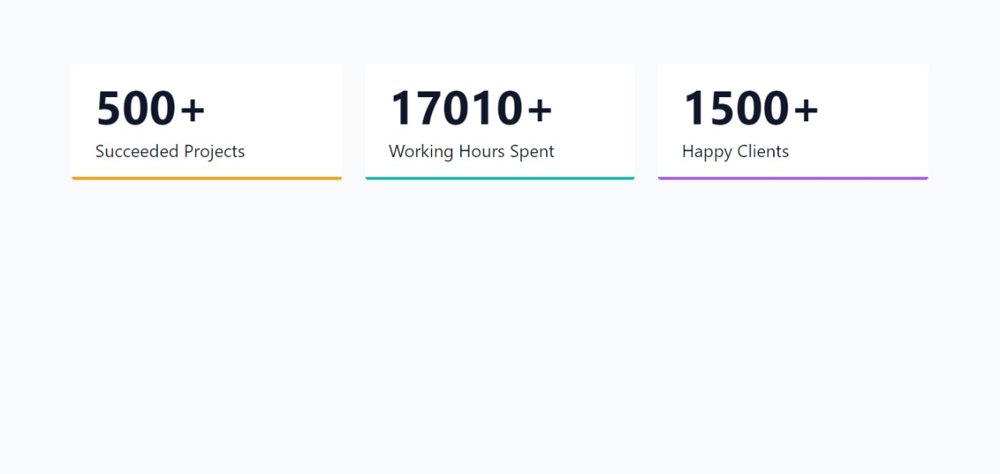

## NUMBERS

[](https://javascript-18-numbers.netlify.app)

#### Logic (JS)

- select all span's with .number
- iterate over and log each span
- create updateCount function
- accept el as argument
- invoke and pass each span el in iteration

```js
const updateCount = (el) => {
  const value = parseInt(el.dataset.value);
  const increment = Math.ceil(value / 1000);
  let initialValue = 0;
};
```

```js
const updateCount = (el) => {
  const value = parseInt(el.dataset.value);
  const increment = Math.ceil(value / 1000);
  let initialValue = 0;

  const increaseCount = setInterval(() => {
    initialValue += increment;

    if (initialValue > value) {
      el.textContent = `${value}+`;
      clearInterval(increaseCount);
      return;
    }
    el.textContent = `${initialValue}+`;
  }, 1);
};
```

## Author

- Portfolio - [@mraditya1999](https://www.adityayadav.live)
- Twitter - [@mraditya1999](https://twitter.com/mraditya1999)
- Linkedin - [@mraditya1999](https://www.linkedin.com/in/mraditya1999/)
- Medium - [@mraditya1999](https://medium.com/@mraditya1999)
- Frontend Mentor - [@mraditya1999](https://www.frontendmentor.io/profile/Aditya-oss-creator)
