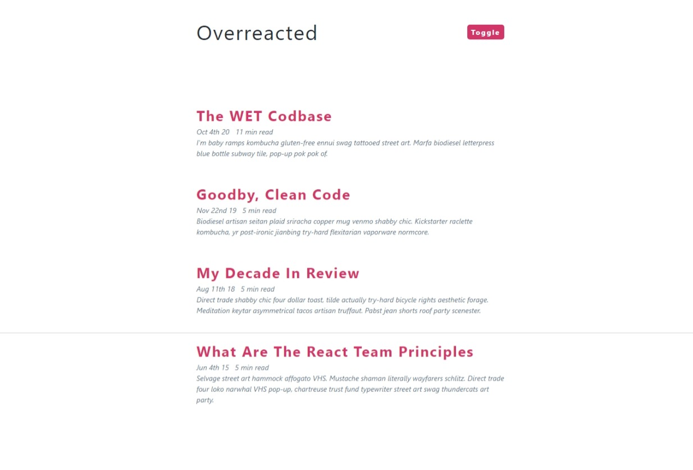

## DARK MODE

#### Toggle - JS

- select button
- add click event listener

#### Toggle - CSS

- create .dark-theme class

#### Toggle - JS

- select root element (html), toggle .dark-theme

#### Import Data

#### Display Articles

- select articles
- iterate over, return article.post for each article

#### Format Date

- import moment.js
- format date
