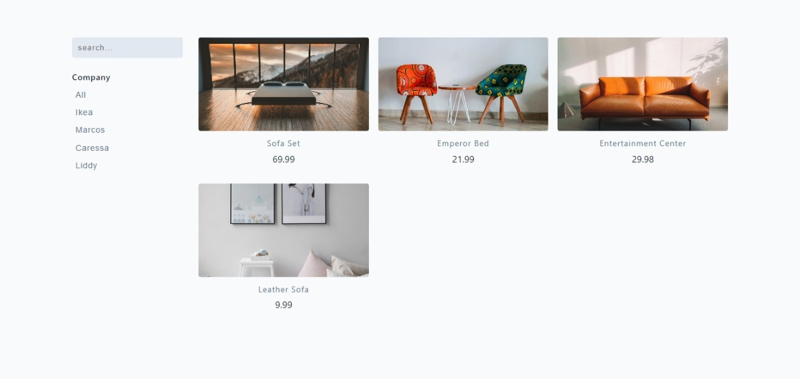

## FILTERS

[](https://javascript-20-filters.netlify.app)

#### Display Products

- import products
- make a copy and assign to new variable (use let keyword)
- select .products-container
- setup a function displayProducts, iterate over products, display them

#### Filter Based On Text

- select form, input
- listen for 'keyup' events on form
- get input value
- filter based on the input value
- call displayProducts

```js
// Text Filter

const form = document.querySelector('.input-form');
const searchInput = document.querySelector('.search-input');

form.addEventListener('keyup', () => {
  // keyup - fired when key released
  const inputValue = searchInput.value;
  filteredProducts = products.filter((product) => {
    return product.title.toLowerCase().includes(inputValue);
  });
  displayProducts();
});
```

#### Empty Array

- displayProducts()
- check length of filteredProducts
- if list.length < 1
- set productsContainer = some text

#### Display Filter Buttons

- select .companies
- create function displayButtons
- get only unique companies (set)
- iterate over results
- return button with data-id
- set .companies innerHTML equal to result

#### Filter Based on Company

- add event listener on .companies
- look for event.target
- if contains .company-btn proceed
  - if 'all' return all products (copy)
  - else filter based on company value
- set search value ''
- call displayProducts

## Author

- Portfolio - [@mraditya1999](https://www.adityayadav.live)
- Twitter - [@mraditya1999](https://twitter.com/mraditya1999)
- Linkedin - [@mraditya1999](https://www.linkedin.com/in/mraditya1999/)
- Medium - [@mraditya1999](https://medium.com/@mraditya1999)
- Frontend Mentor - [@mraditya1999](https://www.frontendmentor.io/profile/Aditya-oss-creator)
