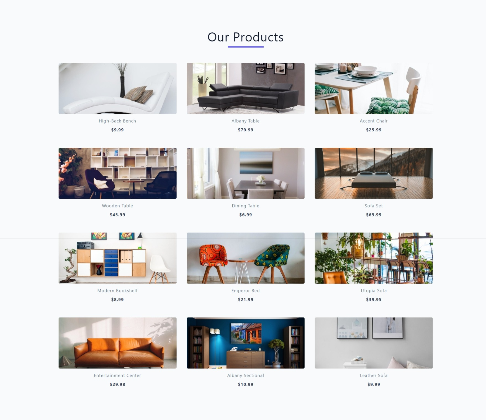

## PRODUCTS

#### API Docs

- (Course API)[https://course-api.com/]

- (Products)[https://course-api.com/javascript-store-products]

- (Single Product)[https://course-api.com/javascript-store-single-product?id=rec43w3ipXvP28vog]

#### Fetch Products

- select .products-center
- fetch products
- log result
- try/catch

#### Loading and Error

- add loading while fetching
- add error in catch

#### Display Products - Setup

- return data from fetchProducts
- create displayProducts(list)
- create start()
- invoke fetchProducts and displayProducts in start
- invoke start

#### Display Products - Complete

- iterate over list
- pull out all the values
- set productsDOM equal to result

#### product.js setup

- create product.js
- link product.html
- select .product
- get single product url
- setup fetchProduct(),displayProduct(),start()

#### Loading, Error, Fetch Single Product

- fetch single product
- setup loading and error
- make id dynamic
- new URLSearchParams
- window.location.search
- get(keyName)

#### Display Single Product

#### Display Colors

- iterate over colors array
- return span with dynamic color value

## Author

- Portfolio - [@mraditya1999](https://www.adityayadav.live)
- Twitter - [@mraditya1999](https://twitter.com/mraditya1999)
- Linkedin - [@mraditya1999](https://www.linkedin.com/in/mraditya1999/)
- Medium - [@mraditya1999](https://medium.com/@mraditya1999)
- Frontend Mentor - [@mraditya1999](https://www.frontendmentor.io/profile/Aditya-oss-creator)
