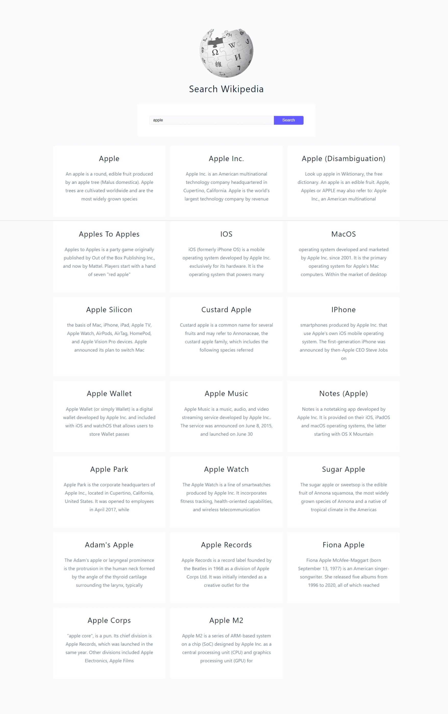

# WIKIPEDIA

#### API DOCS

- [wiki docs](https://www.mediawiki.org/wiki/API:Main_page)

#### Initial Setup

- select form, input, results
- listen for submit events
- if empty value, display error
- create fetchPages()
- pass valid input value into the fetchPages()

#### Fetch Pages

- display loading while fetching
- construct dynamic url
- display if error
- display error no items
- create renderResults()
- pass valid results into renderResults()

#### Render Results

- iterate over the list
- pull out title, snippet, pageid
- setup a card
- set results with div.articles and list inside

## Author

- Portfolio - [@mraditya1999](https://www.adityayadav.live)
- Twitter - [@mraditya1999](https://twitter.com/mraditya1999)
- Linkedin - [@mraditya1999](https://www.linkedin.com/in/mraditya1999/)
- Medium - [@mraditya1999](https://medium.com/@mraditya1999)
- Frontend Mentor - [@mraditya1999](https://www.frontendmentor.io/profile/Aditya-oss-creator)
