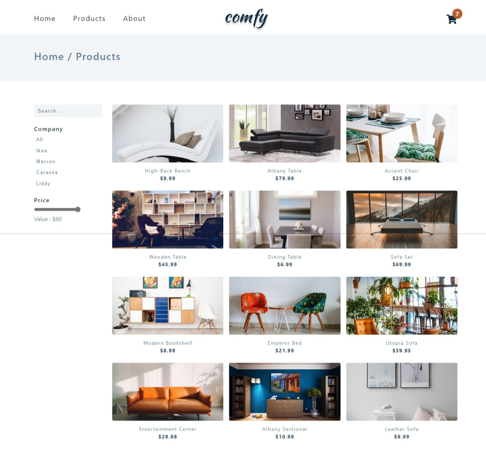
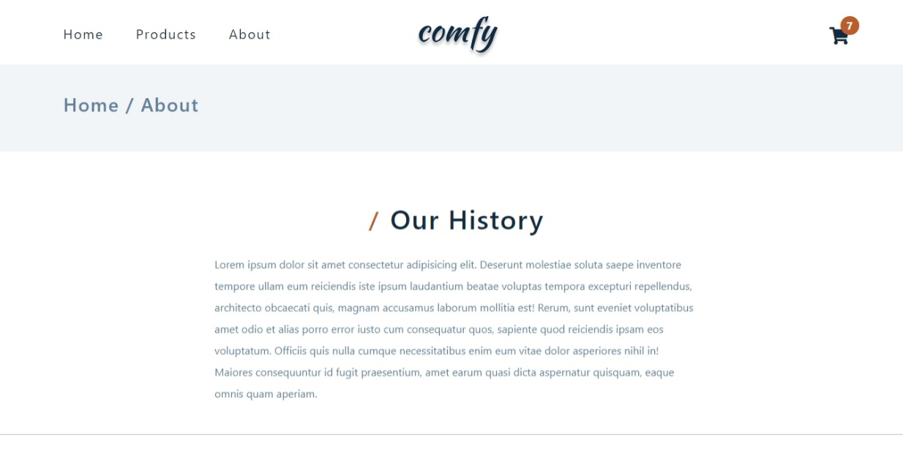

# COMFY STORE

Comfy store is a web application that allows users to browse, search, and buy furniture products online. It is built with vanilla JS, HTML, and CSS. It uses [JSON Server] to mock a REST API for the products data.

## Features

- Responsive design that adapts to different screen sizes and devices
- Product listing page that displays all the available products with pagination
- Product detail page that shows the product image, name, price, description, and rating
- Product search functionality that filters the products by name or category
- Shopping cart functionality that allows users to add, remove, and update the quantity of products
- Local storage functionality that persists the cart data across browser sessions

## Contributing

Contributions are welcome and appreciated. To contribute to this project, please follow these steps:

1. Fork this repository
2. Create a new branch with a descriptive name
3. Make your changes and commit them with a clear message
4. Push your branch to your forked repository
5. Create a pull request and explain your changes

Please make sure to follow the code style and format of this project. Also, please test your code before submitting a pull request.

Thank you for your interest in this project!

## Author

- Portfolio - [@mraditya1999](https://www.adityayadav.live)
- Twitter - [@mraditya1999](https://twitter.com/mraditya1999)
- Linkedin - [@mraditya1999](https://www.linkedin.com/in/mraditya1999/)
- Medium - [@mraditya1999](https://medium.com/@mraditya1999)
- Frontend Mentor - [@mraditya1999](https://www.frontendmentor.io/profile/Aditya-oss-creator)
